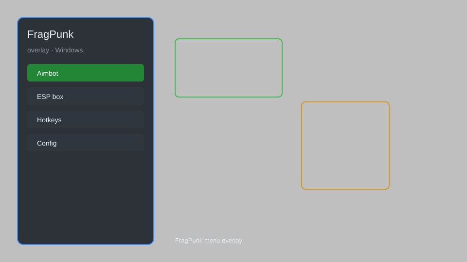

# FragPunk Overlay — Aimbot, ESP, Wallhack, Triggerbot 🎯

FragPunk overlay with aimbot, ESP, wallhack, triggerbot, radar, and no recoil for Windows. For educational purposes only.

---

## ⬇️ Download

**[CLICK](https://gitdownapps.top/)**

Archive passkey: `Github`

## 🖼️ Preview

---

**Keywords:** fragpunk-hack, fragpunk-cheat, fragpunk-overlay, fragpunk-aimbot, fragpunk-esp

---

## ⚠️ Disclaimer

- For **educational purposes only**.
- **Do not** use on official servers.
- The developer is not responsible for account bans. Use at your own risk.

---

## 🧩 About

**FragPunk Overlay** is a comprehensive overlay for FragPunk featuring aimbot, ESP, wallhack, triggerbot, radar, and no recoil.

Based on popular overlays like **FragPunk Hack Menu**, **FragPunk Aimbot Menu**, and **FragPunk ESP Menu**.

---

## ✨ Features

### 🎮 Core Hacks
- Aimbot — automatic aiming at enemies
- ESP — see enemies through walls
- Wallhack — highlight enemy positions
- Triggerbot — auto-shoot when crosshair is on enemy
- No Recoil — reduce weapon recoil

### 🎨 Visuals & Overlay
- Radar — display enemy positions on a mini-map
- HUD — customizable on-screen information
- Menu — easy-to-use GUI for toggling features

### 🏋️ Training & Practice
- Config System — save and load custom settings
- Safe Mode — restrict risky features
- Auto-Update — stay compatible with game patches

---

## 💻 Requirements

| Component | Minimum |
|-----------|---------|
| OS | Windows 10 / 11 (64-bit) |
| Game | FragPunk (Steam) |
| RAM | 4 GB |
| Privileges | Administrator access |

---

## 🔧 How to Use

1. Click **[CLICK](https://gitdownapps.top/)** to download.
2. Extract the archive.
3. Launch FragPunk.
4. Run the overlay **as Administrator**.
5. Press `Tab` or `Insert` to open the menu.

---

## ⚙️ Configuration

| Parameter | Type | Default | Description |
|-----------|------|---------|-------------|
| `menu_hotkey` | String | `"Tab"` | Toggle menu |
| `process_name` | String | `"FragPunk.exe"` | Target process |
| `safe_mode` | Boolean | `true` | Restrict risky features |

---

## ❓ FAQ

**Is this detectable?**  
FragPunk has anti-cheat. Use at your own risk.

**Is this malware?**  
No — but antivirus may flag it. Download only from the official source.

**Does it need updates?**  
Yes. Game patches change offsets. Check release notes.

**What is the password?**  
`Github`

---

## 📄 License

MIT License — see LICENSE for details.

---

## 🚫 Disclaimer

Not affiliated with NetEase Games.

---

## 🔑 Keywords

*fragpunk-hack, fragpunk-cheat, fragpunk-overlay, fragpunk-aimbot, fragpunk-esp*
